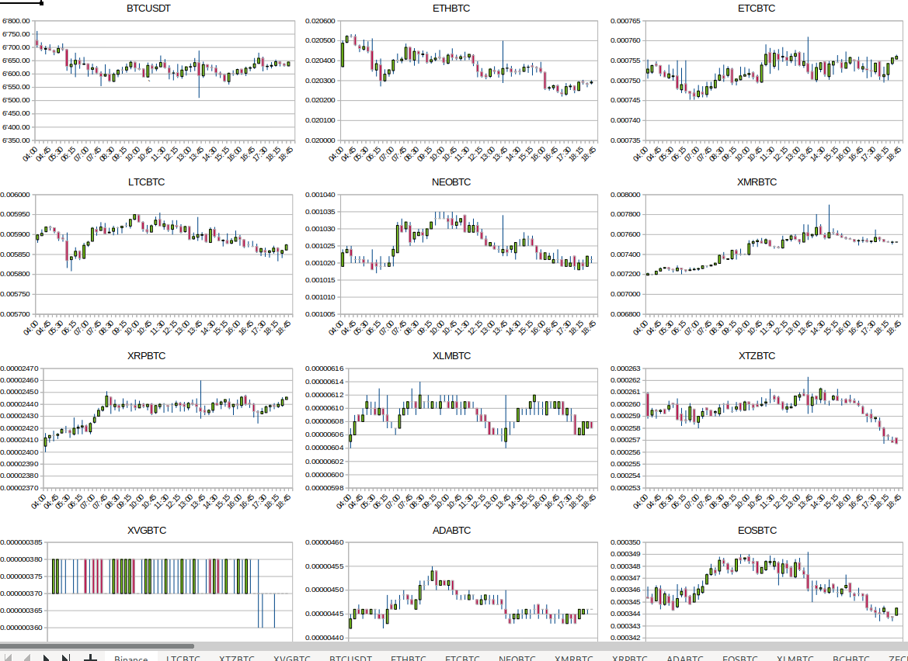

* open the file "Binance_Currencies.ods" in LibreOffice (https://libreoffice.org)
* enable the automatic update of external links
* run the "get_prices.sh" script in a terminal (see below)

set your personal API keys
==========================

* get your personal API access keys on https://binance.com
* edit the file "binance.sh" and enter key and secret

get price candlesticks
======================
(Linux/OSX only)

watch -p -n $((15*60)) -c ./get_prices.sh

installation on Windows
=======================

get MSYS2 from https://www.msys2.org

install 'jq': 

   pacman -S -v mingw-w64-x86_64-jq

run in a 64-bit subsystem terminal (should indicate 'MINGW64'):

   while [ true ]; do  ./get_prices.sh; sleep $((14*60+55));  done

